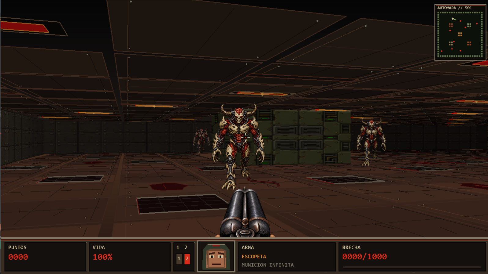

# DOOM... digo DUCK

Un proyecto didáctico para entender cómo los videojuegos de los años 90
creaban la ilusión de un mundo tridimensional usando matemáticas, mapas 2D y
un renderizador mucho más sencillo que un motor 3D moderno.



## Requisitos

- Python 3.10 o posterior
- Pygame 2.6.1
- NumPy 2.x

Instala las dependencias con:

```powershell
python -m pip install -r requirements.txt
```

## Cómo ejecutar

Desde la carpeta del proyecto, inicia el juego con:

```powershell
python main.py
```

Para abrirlo a pantalla completa:

```powershell
python main.py --pantalla-completa
```

En Windows también puedes usar `ejecutar.bat`.

## Ejecutar en un sitio web

El juego puede publicarse conservando Python y Pygame mediante
[`pygbag`](https://pypi.org/project/pygbag/), que compila el proyecto a
WebAssembly. El bucle principal ya cede el control al navegador en cada
fotograma, que es necesario para esta versión web.

Instala el empaquetador con una instalación de Python activa:

```powershell
python -m pip install pygbag
```

Desde la carpeta del proyecto, genera y sirve la versión web:

```powershell
python -m pygbag --bind 127.0.0.1 main.py
```

Abre la URL que muestre el comando, normalmente
`http://127.0.0.1:8000`. Para publicarlo, sube el contenido generado en
`build/web` a un hosting de archivos estáticos como GitHub Pages, Netlify o
itch.io. El navegador debe cargarlo mediante HTTP/HTTPS, no abriendo el HTML
con doble clic.

La primera interacción debe ser un clic dentro del juego para que el
navegador permita capturar el ratón y reproducir audio. La pantalla completa
se controla desde el navegador; el argumento `--pantalla-completa` no es
necesario en la versión web.

Controles principales: `WASD` para moverte, ratón o flechas para girar,
clic izquierdo o `Espacio` para disparar, `1` y `2` para cambiar de arma,
`R` o `Enter` para iniciar o reiniciar, `F11` para pantalla completa y `Esc`
para volver al menú. La partida continúa por oleadas: cada ronda aumenta la
cantidad y la vida de los enemigos, y cada baja suma puntos. Al perder, escribe
tu nombre y pulsa `Enter` para guardar la puntuación en el ranking local.

## Objetivo

La meta no es reconstruir el código original de DOOM, sino estudiar las ideas
que hicieron posibles los shooters clásicos: cómo un mapa plano puede
convertirse en una vista en primera persona, cómo se proyectan las paredes y
cómo se dibujan enemigos y armas con recursos bidimensionales.

El título es la broma del proyecto: **DOOM... digo DUCK**. El resultado es un
pequeño juego jugable y, al mismo tiempo, una demostración visual de lo que
ocurre en cada fotograma.

## Qué se explora

- **Mapas 2D y coordenadas:** el mundo se representa como una matriz de
  celdas, donde cada valor identifica un tipo de pared o un espacio libre.
- **Raycasting y DDA:** se lanzan rayos desde la cámara y se calcula la celda
  exacta que alcanza cada uno sin recorrer píxeles innecesarios.
- **Corrección del efecto de ojo de pez:** las distancias laterales se corrigen
  para que las paredes rectas sigan viéndose rectas.
- **Proyección en perspectiva:** la distancia al impacto determina la altura
  de cada columna vertical que forma la escena.
- **Suelo, techo y materiales:** se combinan texturas, geometría procedural,
  luces, sombras y atmósfera para dar profundidad al mapa.
- **Sprites y billboards:** los enemigos y las armas son imágenes 2D que se
  escalan y orientan para parecer parte del mundo.
- **Oclusión por profundidad:** un `depth_buffer` evita que los enemigos
  aparezcan a través de las paredes.
- **Movimiento y colisiones:** el jugador usa trigonometría, desplazamiento
  independiente de los FPS y colisiones deslizantes.
- **Enemigos:** se incluyen estados de reposo, marcha, ataque, daño y muerte,
  además de navegación para rodear obstáculos.
- **Bucle de juego:** la actualización de la lógica y el dibujo se separan
  para mantener un comportamiento estable en cada fotograma.

El raycasting de este proyecto es una aproximación educativa relacionada con
los primeros shooters en primera persona. El DOOM original utilizaba un
renderizador basado en sectores y árboles BSP; aquí se usa un raycaster para
que el proceso sea más fácil de observar y explicar desde cero.

## Estructura del proyecto

```text
.
├── README.md                         — explicación del proyecto y su objetivo.
├── requirements.txt                  — dependencias de Python.
├── ejecutar.bat                      — lanzador opcional para Windows.
├── main.py                           — bucle principal, entrada y estados.
├── map_data.py                       — mapa 2D, materiales y apariciones.
├── raycasting.py                     — rayos DDA y distancias de paredes.
├── entities.py                       — jugador, enemigos, movimiento y colisiones.
├── renderer.py                       — paredes, suelo, techo, sprites, armas y HUD.
├── settings.py                       — constantes de cámara, física y renderizado.
├── audio.py                          — sonidos opcionales y respaldo procedural.
├── pruebas_logica.py                 — regresiones de lógica del motor.
└── assets/                           — recursos visuales finales del juego.
    ├── README.md                     — procedencia y permisos de los recursos.
    ├── audio/
    │   └── README.md                 — nota sobre efectos de sonido opcionales.
    ├── enemies/
    │   ├── demon_idle.png            — enemigo en reposo.
    │   ├── demon_walk_a.png          — primer cuadro de movimiento.
    │   ├── demon_walk_b.png          — segundo cuadro de movimiento.
    │   ├── demon_attack_prepare.png  — preparación del ataque.
    │   ├── demon_attack_strike.png   — golpe del ataque.
    │   ├── demon_hurt.png            — enemigo recibiendo daño.
    │   ├── demon_death_fall.png      — comienzo de la muerte.
    │   ├── demon_death_impact.png    — impacto final de la muerte.
    │   └── demon_corpse.png           — cadáver del enemigo.
    ├── previews/
    │   └── gameplay_documental.png   — captura de gameplay para este README.
    ├── weapons/
    │   ├── doom_rifle.png             — arma principal.
    │   ├── doom_shotgun_closed.png    — escopeta cerrada.
    │   └── doom_shotgun_open.png      — escopeta abierta durante la acción.
    ├── textures/
    │   ├── walls/
    │   │   ├── wall_1_steel.png      — pared metálica.
    │   │   ├── wall_2_blood.png      — pared con manchas rojas.
    │   │   ├── wall_3_toxic.png      — pared industrial tóxica.
    │   │   ├── wall_4_hazard.png     — pared con señalización de peligro.
    │   │   ├── wall_5_bone.png       — pared de textura ósea.
    │   │   └── wall_6_rust.png        — pared oxidada.
    │   ├── floors/
    │   │   ├── floor_steel.png        — suelo metálico.
    │   │   ├── floor_grate.png        — suelo de rejilla.
    │   │   └── floor_dirty.png        — suelo industrial desgastado.
    │   └── ceilings/
    │       ├── ceiling_steel.png      — techo metálico.
    │       ├── ceiling_grate.png      — techo de rejilla.
    │       └── ceiling_rust.png       — techo oxidado.
    └── menu_background_doom.png       — fondo industrial activo del menú.
```

## Enfoque del proyecto

Cada sistema está separado para que pueda estudiarse por partes: primero el
mapa, después los rayos, la proyección, las entidades y finalmente la
composición del fotograma. La intención es mostrar la tecnología que había
detrás de los juegos de los 90 con ejemplos visuales y código legible, sin
ocultar el proceso detrás de un motor externo.

Los recursos visuales incluidos fueron creados específicamente para este
proyecto con herramientas de inteligencia artificial y cuentan con la licencia
o autorización necesaria para su uso y distribución dentro del repositorio.

## Audio

This repository does not include the original game audio, voice lines, or
modified sound effects used in the video. The project remains playable without
those files by using its built-in audio fallback system.

## Más información

- YouTube channel: https://youtube.com/@BrayanCode
- Video walkthrough: https://youtu.be/FYUqyhQbzE0
